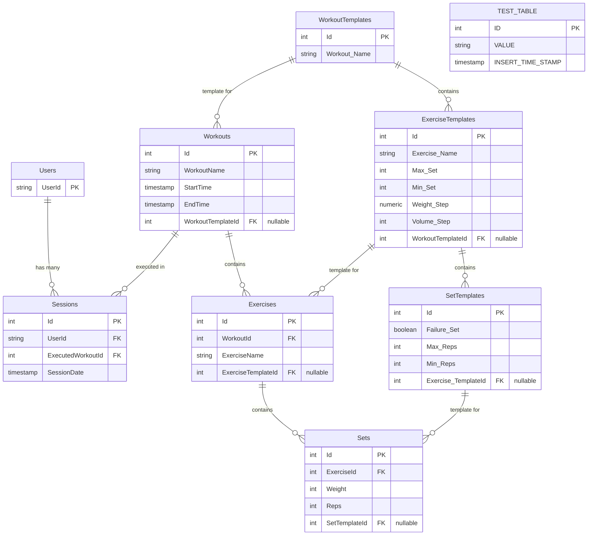

# Overload Database Schema Documentation

This document provides a comprehensive specification of the PostgreSQL database schema for the Overload application, as defined by Entity Framework Core migrations and `AppDbContext` model configurations.

---

## 1. System Overview

- **Database Engine**: PostgreSQL (running in Docker container)
- **ORM / Data Access**: Entity Framework Core (`Npgsql.EntityFrameworkCore.PostgreSQL`)
- **DbContext**: `Backend.Data.AppDbContext`
- **Migration Strategy**: EF Core Code-First Migrations

---

## 2. Entity-Relationship Diagram (ERD)

---

## 3. Detailed Table Schemas

### 3.1 `Users`
Stores user profile references for workout sessions.

| Column | C# Type | PostgreSQL Type | Nullable | Key / Index | Description |
| :--- | :--- | :--- | :---: | :---: | :--- |
| `UserId` | `string` | `text` | No | Primary Key | Unique user identifier |

**Relationships:**
- Has many `Sessions` (Delete behavior: **Cascade**)

---

### 3.2 `Sessions`
Tracks completed user workout sessions.

| Column | C# Type | PostgreSQL Type | Nullable | Key / Index | Description |
| :--- | :--- | :--- | :---: | :---: | :--- |
| `Id` | `int` | `integer` | No | Primary Key (Identity) | Auto-incrementing session ID |
| `UserId` | `string` | `text` | No | FK, Index (`IX_Sessions_UserId`) | Reference to `Users.UserId` |
| `ExecutedWorkoutId` | `int` | `integer` | No | FK, Index (`IX_Sessions_ExecutedWorkoutId`) | Reference to `Workouts.Id` |
| `SessionDate` | `DateTime` | `timestamp with time zone` | No | - | Date and time session occurred |

**Computed Properties (Model Level):**
- `Duration`: Computed dynamically as `ExecutedWorkout.EndTime - ExecutedWorkout.StartTime`.

**Relationships:**
- Belongs to `User` via `UserId` (FK constraint: `FK_Sessions_Users_UserId`, Delete behavior: **Cascade**).
- Belongs to `Workout` via `ExecutedWorkoutId` (FK constraint: `FK_Sessions_Workouts_ExecutedWorkoutId`, Delete behavior: **Cascade**).

---

### 3.3 `Workouts`
Represents an instance of a workout execution.

| Column | C# Type | PostgreSQL Type | Nullable | Key / Index | Description |
| :--- | :--- | :--- | :---: | :---: | :--- |
| `Id` | `int` | `integer` | No | Primary Key (Identity) | Auto-incrementing workout ID |
| `WorkoutName` | `string` | `text` | No | - | Name of the workout |
| `StartTime` | `DateTime` | `timestamp with time zone` | No | - | Workout start timestamp |
| `EndTime` | `DateTime` | `timestamp with time zone` | No | - | Workout completion timestamp |
| `WorkoutTemplateId` | `int?` | `integer` | Yes | FK, Index (`IX_Workouts_WorkoutTemplateId`) | Optional reference to `WorkoutTemplates.Id` |

**Relationships:**
- Has many `Exercises` (Delete behavior: **Cascade**).
- Optionally references `Workout_Template` via `WorkoutTemplateId` (FK constraint: `FK_Workouts_WorkoutTemplates_WorkoutTemplateId`, Delete behavior: **SetNull**).

---

### 3.4 `Exercises`
Represents an exercise performed within a specific workout.

| Column | C# Type | PostgreSQL Type | Nullable | Key / Index | Description |
| :--- | :--- | :--- | :---: | :---: | :--- |
| `Id` | `int` | `integer` | No | Primary Key (Identity) | Auto-incrementing exercise ID |
| `WorkoutId` | `int` | `integer` | No | FK, Index (`IX_Exercises_WorkoutId`) | Reference to `Workouts.Id` |
| `ExerciseName` | `string` | `text` | No | - | Name of the exercise |
| `ExerciseTemplateId` | `int?` | `integer` | Yes | FK, Index (`IX_Exercises_ExerciseTemplateId`) | Optional reference to `ExerciseTemplates.Id` |

**Relationships:**
- Belongs to `Workout` via `WorkoutId` (FK constraint: `FK_Exercises_Workouts_WorkoutId`, Delete behavior: **Cascade**).
- Has many `Sets` (Delete behavior: **Cascade**).
- Optionally references `Exercise_Template` via `ExerciseTemplateId` (FK constraint: `FK_Exercises_ExerciseTemplates_ExerciseTemplateId`, Delete behavior: **SetNull**).

---

### 3.5 `Sets`
Represents an individual set performed for an exercise. Inherits fields from `Set_Value`.

| Column | C# Type | PostgreSQL Type | Nullable | Key / Index | Description |
| :--- | :--- | :--- | :---: | :---: | :--- |
| `Id` | `int` | `integer` | No | Primary Key (Identity) | Auto-incrementing set ID |
| `ExerciseId` | `int` | `integer` | No | FK, Index (`IX_Sets_ExerciseId`) | Reference to `Exercises.Id` |
| `Weight` | `int` | `integer` | No | - | Weight lifted in this set |
| `Reps` | `int` | `integer` | No | - | Repetitions completed in this set |
| `SetTemplateId` | `int?` | `integer` | Yes | FK, Index (`IX_Sets_SetTemplateId`) | Optional reference to `SetTemplates.Id` |

**Relationships:**
- Belongs to `Exercise` via `ExerciseId` (FK constraint: `FK_Sets_Exercises_ExerciseId`, Delete behavior: **Cascade**).
- Optionally references `Set_Template` via `SetTemplateId` (FK constraint: `FK_Sets_SetTemplates_SetTemplateId`, Delete behavior: **SetNull**).

---

### 3.6 `WorkoutTemplates`
Defines reusable workout templates.

| Column | C# Type | PostgreSQL Type | Nullable | Key / Index | Description |
| :--- | :--- | :--- | :---: | :---: | :--- |
| `Id` | `int` | `integer` | No | Primary Key (Identity) | Auto-incrementing workout template ID |
| `Workout_Name` | `string` | `text` | No | - | Name of the workout template |

**Relationships:**
- Has many `ExerciseTemplates` via `Exercise_Template.WorkoutTemplateId`.

---

### 3.7 `ExerciseTemplates`
Defines progressive overload progression rules and set constraints for an exercise template.

| Column | C# Type | PostgreSQL Type | Nullable | Key / Index | Description |
| :--- | :--- | :--- | :---: | :---: | :--- |
| `Id` | `int` | `integer` | No | Primary Key (Identity) | Auto-incrementing exercise template ID |
| `Exercise_Name` | `string` | `text` | No | - | Name of the exercise template |
| `Max_Set` | `int` | `integer` | No | - | Maximum target set count |
| `Min_Set` | `int` | `integer` | No | - | Minimum target set count |
| `Weight_Step` | `decimal` | `numeric` | No | - | Weight increment percentage step (default 0.05 / 5%) |
| `Volume_Step` | `int` | `integer` | No | - | Repetition volume step (default 1) |
| `WorkoutTemplateId` | `int?` | `integer` | Yes | FK, Index (`IX_ExerciseTemplates_WorkoutTemplateId`) | Reference to parent `WorkoutTemplates.Id` |

**Relationships:**
- Belongs to `Workout_Template` via `WorkoutTemplateId` (FK constraint: `FK_ExerciseTemplates_WorkoutTemplates_WorkoutTemplateId`).
- Has many `SetTemplates` via `Set_Template.Exercise_TemplateId`.

---

### 3.8 `SetTemplates`
Defines rep range and failure criteria for a specific set within an exercise template.

| Column | C# Type | PostgreSQL Type | Nullable | Key / Index | Description |
| :--- | :--- | :--- | :---: | :---: | :--- |
| `Id` | `int` | `integer` | No | Primary Key (Identity) | Auto-incrementing set template ID |
| `Failure_Set` | `bool` | `boolean` | No | - | Indicates whether the set is taken to failure |
| `Max_Reps` | `int` | `integer` | No | - | Target ceiling rep threshold |
| `Min_Reps` | `int` | `integer` | No | - | Target floor rep threshold |
| `Exercise_TemplateId` | `int?` | `integer` | Yes | FK, Index (`IX_SetTemplates_Exercise_TemplateId`) | Reference to parent `ExerciseTemplates.Id` |

**Relationships:**
- Belongs to `Exercise_Template` via `Exercise_TemplateId` (FK constraint: `FK_SetTemplates_ExerciseTemplates_Exercise_TemplateId`).

---

### 3.9 `TEST_TABLE`
Initial scaffolding demonstration table.

| Column | C# Type | PostgreSQL Type | Nullable | Key / Index | Description |
| :--- | :--- | :--- | :---: | :---: | :--- |
| `ID` | `int` | `integer` | No | Primary Key (Identity) | Auto-incrementing row ID |
| `VALUE` | `string` | `text` | No | - | Test string value input |
| `INSERT_TIME_STAMP` | `DateTime` | `timestamp with time zone` | No | - | Creation timestamp (UTC) |

---

## 4. Foreign Keys and Constraints Summary

| Constraint Name | Source Table | Source Column | Target Table | Target Column | Delete Action |
| :--- | :--- | :--- | :--- | :--- | :--- |
| `FK_Sessions_Users_UserId` | `Sessions` | `UserId` | `Users` | `UserId` | `Cascade` |
| `FK_Sessions_Workouts_ExecutedWorkoutId` | `Sessions` | `ExecutedWorkoutId` | `Workouts` | `Id` | `Cascade` |
| `FK_Exercises_Workouts_WorkoutId` | `Exercises` | `WorkoutId` | `Workouts` | `Id` | `Cascade` |
| `FK_Sets_Exercises_ExerciseId` | `Sets` | `ExerciseId` | `Exercises` | `Id` | `Cascade` |
| `FK_Workouts_WorkoutTemplates_WorkoutTemplateId` | `Workouts` | `WorkoutTemplateId` | `WorkoutTemplates` | `Id` | `SetNull` |
| `FK_Exercises_ExerciseTemplates_ExerciseTemplateId` | `Exercises` | `ExerciseTemplateId` | `ExerciseTemplates` | `Id` | `SetNull` |
| `FK_Sets_SetTemplates_SetTemplateId` | `Sets` | `SetTemplateId` | `SetTemplates` | `Id` | `SetNull` |
| `FK_ExerciseTemplates_WorkoutTemplates_WorkoutTemplateId` | `ExerciseTemplates` | `WorkoutTemplateId` | `WorkoutTemplates` | `Id` | Client / NoAction |
| `FK_SetTemplates_ExerciseTemplates_Exercise_TemplateId` | `SetTemplates` | `Exercise_TemplateId` | `ExerciseTemplates` | `Id` | Client / NoAction |

---

## 5. EF Core Migration History

The schema was established across three incremental EF Core migrations:

1. **`20260909231850_InitialCreate`**
   - Created `TEST_TABLE` with columns `ID`, `VALUE`, and `INSERT_TIME_STAMP`.

2. **`20260915172014_AddWorkoutSessionModels`**
   - Created core runtime domain tables: `Users`, `Workouts`, `Exercises`, `Sessions`, `Sets`.
   - Added foreign keys and cascade delete rules between `Sessions`, `Users`, `Workouts`, `Exercises`, and `Sets`.

3. **`20260919211727_AddTemplateModels`**
   - Created template configuration tables: `WorkoutTemplates`, `ExerciseTemplates`, `SetTemplates`.
   - Added nullable template foreign key columns:
     - `WorkoutTemplateId` on `Workouts`
     - `ExerciseTemplateId` on `Exercises`
     - `SetTemplateId` on `Sets`
   - Configured `SetNull` delete behaviors for runtime-to-template entity references.
